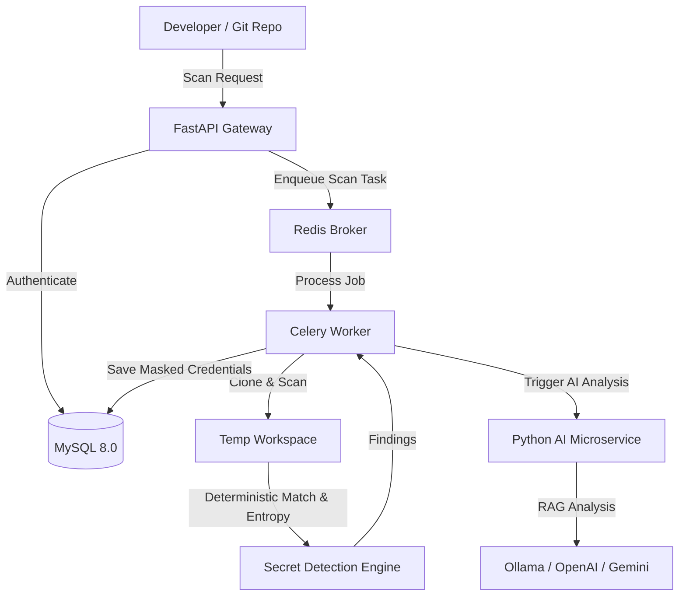

# Sentinel AI

### Enterprise AI-Powered Secret Leak Prevention Platform

Sentinel AI is a production-grade developer security platform that detects, explains, prevents, and remediates secret leaks in Git repositories using deterministic detection, cryptographic techniques, and Generative AI.

---

## Architecture Overview



## Features

- **Multi-Tenant SaaS Backend**: Manage users, roles, organizations, and team environments.
- **Asynchronous Scanning Pipeline**: Uses Celery and Redis to clone and scan repositories concurrently.
- **Advanced Secret Scanner**: Hybrid scanning using deterministic regex matching and Shannon Entropy calculation to catch passwords/tokens with symbols.
- **No Cleartext Credentials**: Hashes matches (SHA-256) and stores only masked placeholders in the database to prevent secondary leaks.

---

## Technical Stack

| Layer | Technology |
|---|---|
| **Backend API** | FastAPI, SQLAlchemy 2.0, Uvicorn, Gunicorn |
| **Worker Engine** | Celery, Redis, GitPython |
| **Database** | MySQL 8.0 |
| **Tests** | Pytest, HTTPX, SQLite (In-Memory) |
| **Deployment** | Docker, Docker Compose |

---

## Directory Structure

```
sentinel-ai/
├── docker-compose.yml     # Multi-container orchestration
├── Makefile               # CLI shortcut commands
├── README.md              # Documentation
└── backend/               # FastAPI Application
    ├── Dockerfile
    ├── requirements.txt
    └── app/
        ├── main.py        # Entrypoint
        ├── api/           # Versioned routers & endpoints
        ├── config/        # Environment configurations
        ├── database/      # Engines & session factories
        ├── models/        # SQLAlchemy schemas
        ├── schemas/       # Pydantic validators
        ├── security/      # JWT & Argon2 password hashing
        ├── scanner/       # Regex/Entropy scanning logic
        └── tasks/         # Celery task definitions
```

---

## Getting Started

### Prerequisites

- **Python**: version 3.11+
- **Docker & Docker Compose**

### Installation

1. Clone the project and configure the virtual environment:
   ```bash
   make setup
   ```
2. Start the database, cache, backend, and worker services using Docker Compose:
   ```bash
   make docker-up
   ```
3. Run the unit tests locally:
   ```bash
   make test
   ```

### API Documentation

Once the services are running, the interactive API documentation is accessible at:
- **Swagger UI**: [http://localhost:8001/docs](http://localhost:8001/docs)
- **ReDoc**: [http://localhost:8001/redoc](http://localhost:8001/redoc)
