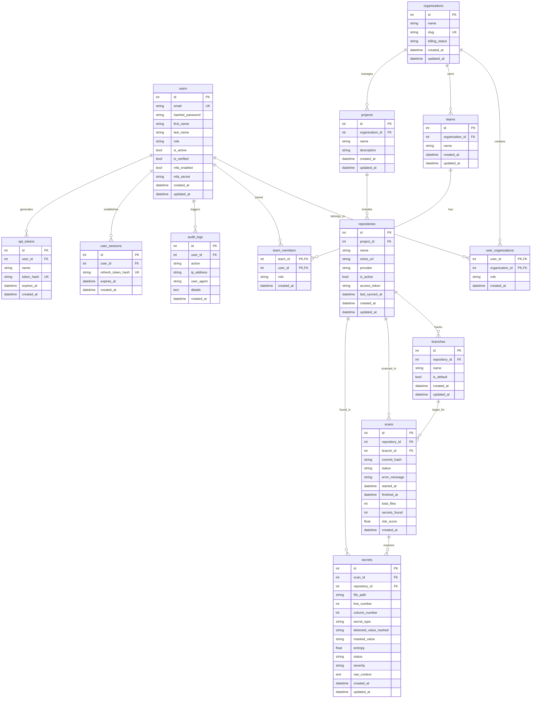

# Sentinel AI - Database Schema Design

Sentinel AI utilizes a MySQL 8.0 relational database to track tenancy, organizations, teams, repositories, scanning metadata, identified secrets, and audit histories.

---

## Entity Relationship (ER) Diagram

---

## Detailed Model Mapping

### 1. `users`
- Stores user credentials, active state, global role (e.g. system `admin` vs standard `member`), and MFA details.
- Hashing utilizes the `Argon2` password hashing scheme.

### 2. `organizations` & `user_organizations`
- Tenancy boundaries. Users can belong to multiple organizations with different organizational roles (`owner`, `member`, `auditor`).
- `slug` is used for front-end subdomains or custom scoping (e.g. `/org/acme-corp`).

### 3. `scans`
- Tracks scanning executions.
- `status` can be `"pending"`, `"running"`, `"completed"`, or `"failed"`.
- `risk_score` is computed automatically on completion from `0` (vulnerable) to `100` (secure).

### 4. `secrets`
- Stores specific leak events.
- **Security Guardrail**: Raw secrets are **never** stored in the database. Instead:
  - `detected_value_hashed`: stores a `SHA-256` hash of the secret string. This allows matching duplicates across different commits/scans without saving cleartext passwords.
  - `masked_value`: stores a secure masked string (e.g. `AKIA...7EXA`) for UI presentation.
  - `raw_context`: stores the matching line with the secret replaced by the masked string.
